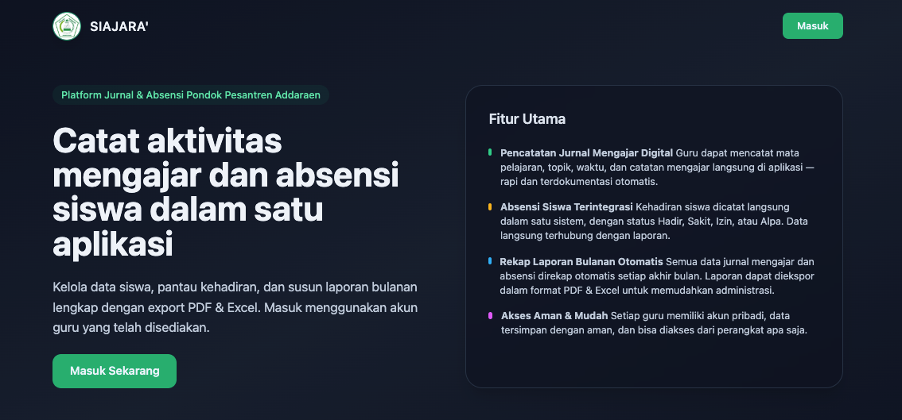

# 🧾 SIAJARA' — Sistem Informasi Jurnal Mengajar Berbasis Web

**SIAJARA'** (Sistem Informasi Jurnal Mengajar) adalah aplikasi berbasis web yang membantu guru dalam mencatat, memantau, dan melaporkan kegiatan mengajar secara digital.  
Aplikasi ini dirancang untuk meningkatkan efisiensi administrasi pembelajaran serta memudahkan pihak sekolah dalam melakukan rekapitulasi data mengajar setiap bulan.

---

## 🚀 Fitur Utama

- 🧑‍🏫 **Jurnal Mengajar Harian**  
  Guru dapat mencatat kegiatan mengajar seperti mata pelajaran, tanggal, jam, topik, dan catatan tambahan.

- 👩‍🎓 **Absensi Siswa**  
  Sistem menyediakan form kehadiran siswa (hadir, sakit, izin, alfa) yang langsung terintegrasi dengan laporan.

- 📊 **Dashboard Interaktif**  
  Menampilkan statistik kehadiran, jumlah jam mengajar, dan aktivitas guru dalam bentuk grafik.

- 📄 **Laporan Otomatis**  
  Dapat men-generate laporan bulanan dan tahunan dalam format PDF dan Excel.

- ⚙️ **Manajemen Data Terpusat (Role-Based Access)**  
  Role **Admin**: CRUD master data (guru, siswa, kelas, mata pelajaran) dan rekap keseluruhan.  
  Role **Guru**

## Contributing

Thank you for considering contributing to the Laravel framework! The contribution guide can be found in the [Laravel documentation](https://laravel.com/docs/contributions).

## Code of Conduct

In order to ensure that the Laravel community is welcoming to all, please review and abide by the [Code of Conduct](https://laravel.com/docs/contributions#code-of-conduct).

## Security Vulnerabilities

If you discover a security vulnerability within Laravel, please send an e-mail to Taylor Otwell via [taylor@laravel.com](mailto:taylor@laravel.com). All security vulnerabilities will be promptly addressed.

## License

The Laravel framework is open-sourced software licensed under the [MIT license](https://opensource.org/licenses/MIT).
